# React + Vite + Tailwind + DaisyUI -> Fullstack Movie Database

Welcome to the Full Stack Movie Database project, built with React, Vite, Tailwind CSS, and DaisyUI. This application includes a self-hosted server and utilizes a MongoDB database with two collections: 'movies' and 'favorites.' Seamlessly integrated into the project are all CRUD (Create, Read, Update, Delete) operations for efficient data management.

## Features:

### Header

The MMBd logo in the header serves as a link to the home page.
A star icon in the header provides a quick link to the Favorites List.
The search input allows users to search for movies by title. An informative toast notification appears, providing the option to navigate to the movie details page upon finding the title or redirect to the MovieForm if the title is not found.
The "Add Your Own" section contains a form for users to add films.

### Home Page

The home page displays a comprehensive list of all available films.
Each movie entry on the home page is a clickable link leading to its respective detail page.

### Detail Page

Users can add or remove films from their favorites list directly from the detail page.
Film properties can be edited, including text properties (file editing functionality coming soon). The edit form triggers a toast notification to provide information to the user.

### Favorites Page

Similar to the home page, the favorites section lists all the user's favorite movies.
Users can remove movies from their favorites list. Each movie entry in the favorites section also includes a link to its respective detail page with editing capabilities.

### Add Page

Users can add their own films through a dedicated form.
The form allows users to add a file or a URL and choose genres for their movie.
A toast notification informs the user of the success or failure of the operation.

# GET (movies & favorites)

<div>
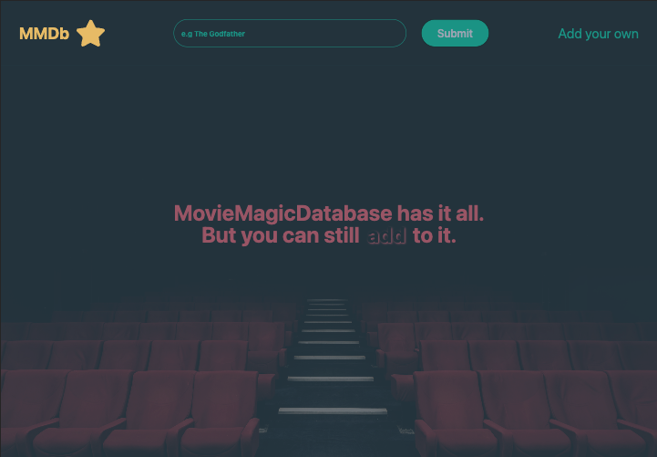
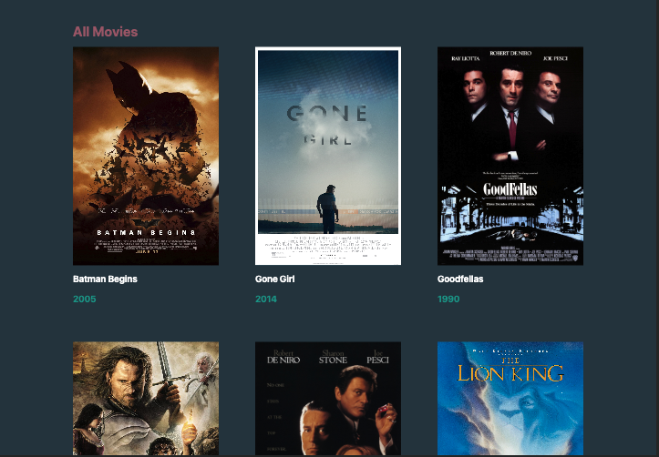
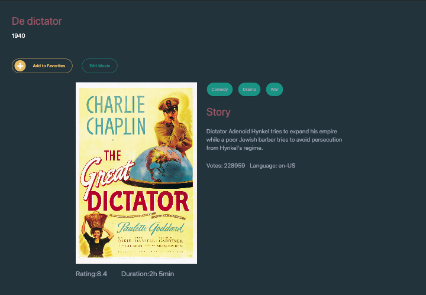

</div>

# POST (movies)

<div>
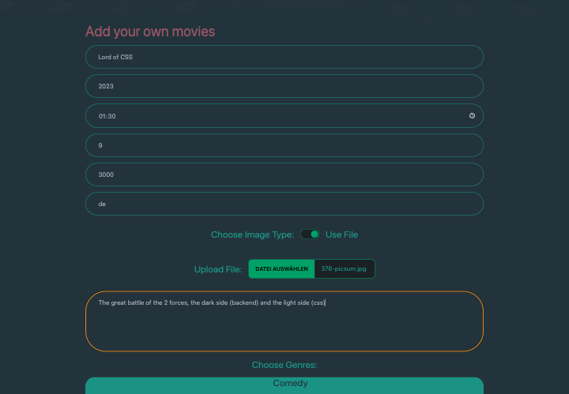
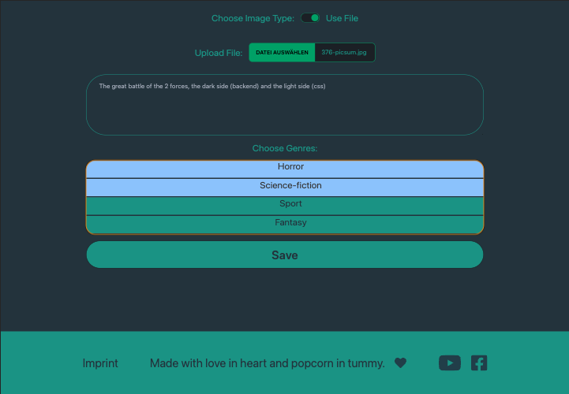
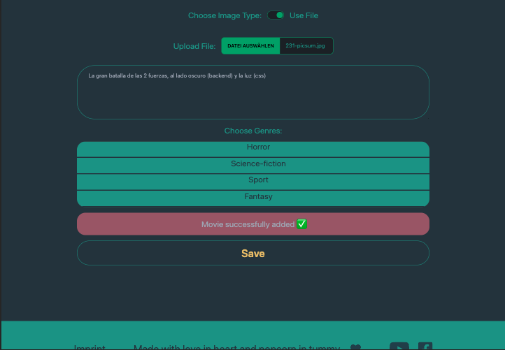
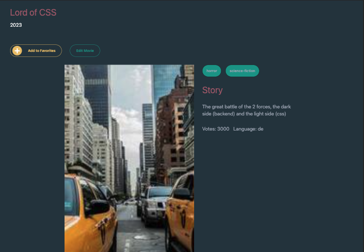
</div>

# POST (favorites)

<div>
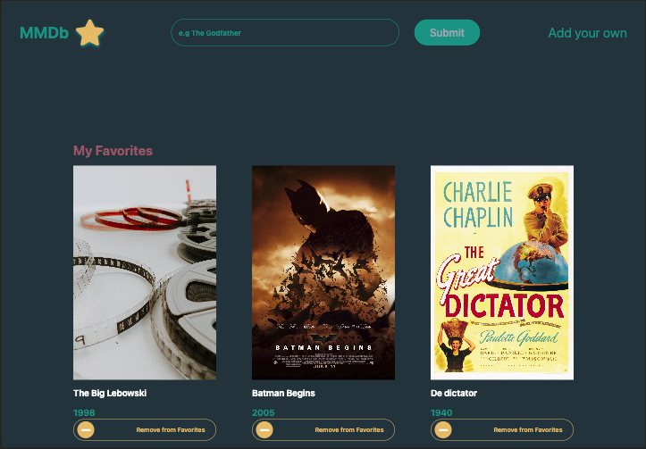

</div>

# DELETE (favorites)

<div>
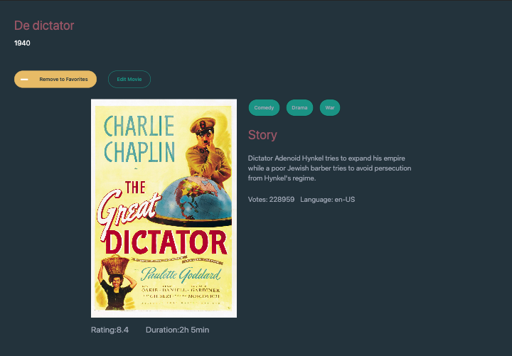
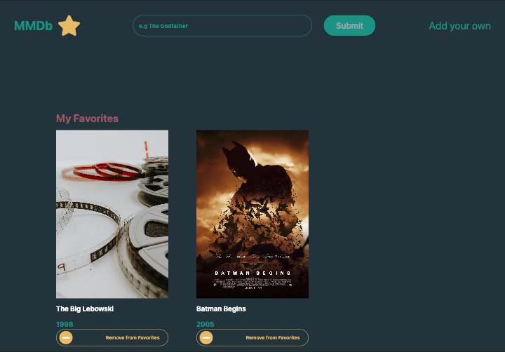
</div>

# GET ONE (movies) // Search Title in Header

<div>
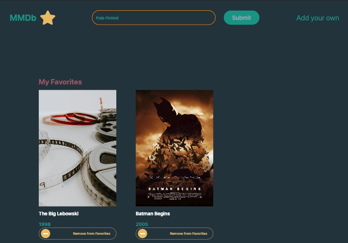
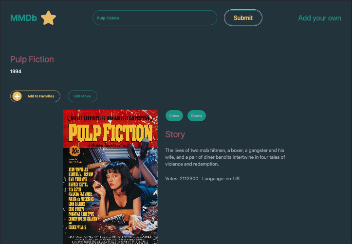
</div>

# PUT (movies & favorites)

<div>

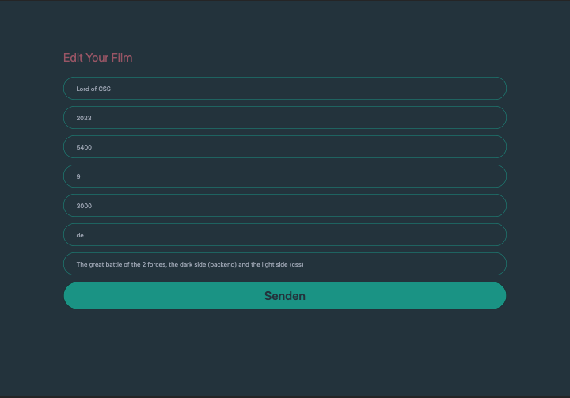
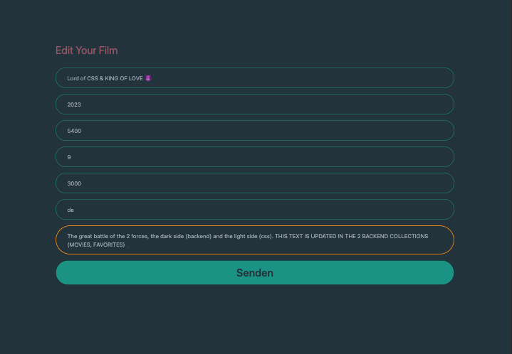
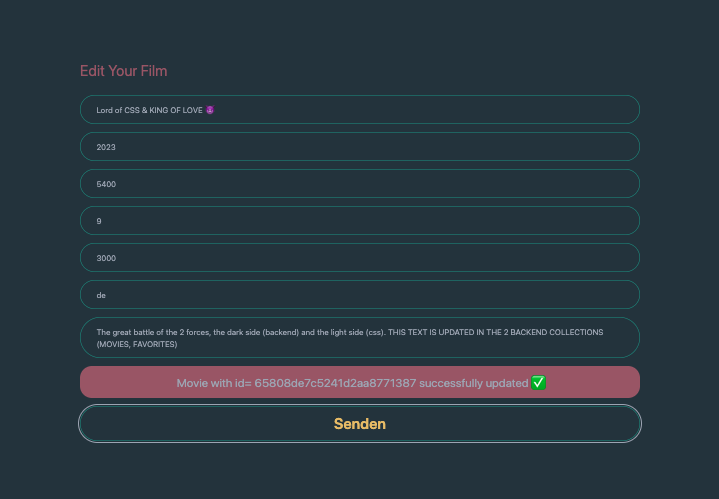
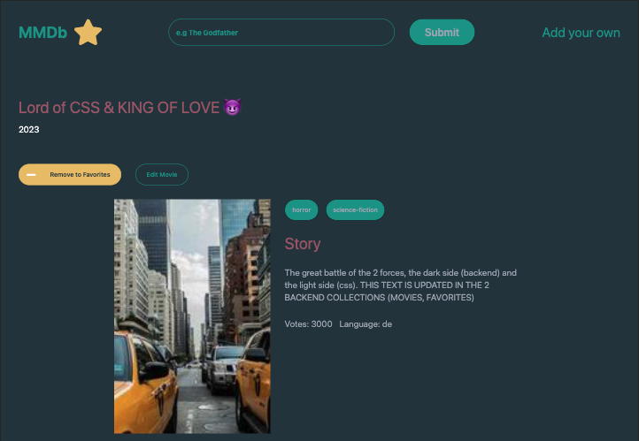</div>

### Setup

npm create vite@latest your-project-name -- --template react

cd your-project-name

npm install react-router-dom

npm i uuid

# Tailwind + Daisyui

npm install -D tailwindcss postcss autoprefixer

npx tailwindcss init -p

npm i -D daisyui@latest

# - IN tailwind.config.js:

```javascript
/** @type {import('tailwindcss').Config} */
export default {
  content: ["./index.html", "./src/**/*.{js,ts,jsx,tsx}"],
  daisyui: {
    themes: ["dark"],
  },
  theme: {
    extend: {
      colors: {
        bgColor_darkgreen: "#283A45",
        primaryColor_green: "#2A9D8F",
        secondaryColor_red: "#A16171",
        accentColor_yellow: "#E9C46A",
      },
      screens: {
        smallmobile: "320px",
        // => @media (min-width: 320px) { ... }

        mobile: "375px",
        // => @media (min-width: 375px) { ... }

        tablet: "769px",
        // => @media (min-width: 768px) { ... }

        laptop: "900px",
        // => @media (min-width: 1000px) { ... }

        desktop: "1280px",
        // => @media (min-width: 1280px) { ... }
        bigdesktop: "1440px",
      },
    },
  },
  plugins: [require("daisyui")],
};
```

# Repo

git init

git add .

git commit -m "first commit"

# IMAGES

PLACEHOLDER from <a href="https://unsplash.com/de/@dmjdenise?utm_content=creditCopyText&utm_medium=referral&utm_source=unsplash">Denise Jans</a> in <a href="https://unsplash.com/de/fotos/vier-rollenfilme-liegen-auf-weissem-tisch-Lq6rcifGjOU?utm_content=creditCopyText&utm_medium=referral&utm_source=unsplash">Unsplash</a>
